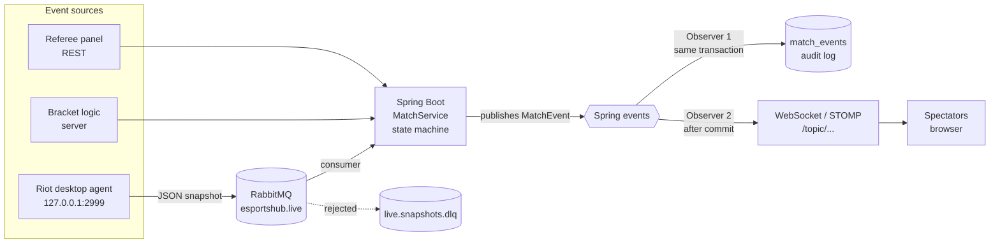

# EsportsHub

> eSports tournament platform for **League of Legends** (multi-game ready) — a player transfer market, tournaments with auto-generated brackets, and real-time match tracking fed by referees and live in-game data. Built with **Spring Boot** and **Angular**.

[](https://github.com/dinoruznic/EsportsHub/actions/workflows/ci.yml)


[Overview](#overview) · [Architecture](#architecture) · [Design Patterns](#design-patterns) · [Database](#database) · [Testing](#testing) · [Getting Started](#getting-started) · [API](#api-overview) · [Project Structure](#project-structure) · [Roadmap](#roadmap)

## Overview

EsportsHub is a platform for amateur esports competition. Players build per-game profiles and get signed through a **transfer market**, organizers run **tournaments** with automatically generated brackets, and every match is **streamed live** to spectators.

The system is an **event + broadcast layer**, not a game controller: server bracket logic, referee input and live in-game data all become the same kind of domain event, which is logged for integrity and pushed to everyone watching.

| | Feature |
|---|---|
| 🔐 | **Accounts & roles** — JWT authentication, role-based authorization (PLAYER, REFEREE, ADMIN …), multiple roles per user |
| 👤 | **Per-game player profiles** — one account per game with region, position and rank; tier-based ranks (LoL, Valorant) or numeric rating (CS2 ELO, Dota MMR) |
| 👥 | **Teams** — captain-owned rosters; a member's game must match the team's game |
| 💱 | **Transfer market** — players list themselves, captains make offers, accepting an offer signs a contract and moves the player into the team |
| 🏆 | **Tournaments** — player-created, admin-approved, team registration with capacity limits |
| 🧩 | **Brackets** — single elimination with standard seeding, generated from registered teams |
| 📡 | **Live matches** — referee-driven match lifecycle, winners advance automatically, real-time WebSocket updates and a full event log |
| 🎮 | **Riot live data** — a desktop agent reads the League client's local API and streams game state through RabbitMQ |

**Multi-game by design.** Games are data, not code: a new game is a row in `games` plus its ranks, positions and regions. Teams, tournaments, brackets and the market work for any game without a code change, and the profile form adapts to the game (`TIER` → rank dropdown, `NUMERIC` → rating field).

## Architecture



- **One event pipeline.** `MatchService` only publishes `MatchEvent`s and does not know who listens. The event logger writes them to `match_events` inside the same transaction; the broadcaster pushes them to spectators **after commit**, so nobody ever sees a result that is later rolled back.
- **Live data is decoupled.** The Riot agent never talks to the backend directly — it publishes to RabbitMQ with a least-privilege broker user (write-only to one exchange). Invalid snapshots (unknown match key, match not live, malformed JSON) are dead-lettered instead of retried forever.
- **Match keys are secrets.** A match's agent key is only visible to its referee, the organizer and admins; public views never expose it.

## Design Patterns

| Pattern | Where | Why |
|---|---|---|
| **Strategy** | `BracketStrategy`, `SingleEliminationStrategy`, `BracketStrategyResolver` | Bracket format is chosen by `tournament.format`; a new format is a new class, the service is unchanged |
| **Builder** | `BracketBuilder` | Strategies describe rounds, matches and advancement links step by step; the service persists the finished plan in two passes |
| **Facade** | `MarketService.acceptOffer` | One call signs a contract, adds the team membership, closes the listing, resets market status and rejects all competing offers |
| **Observer** | `MatchEvent` → `MatchEventLogger`, `MatchBroadcaster` | Logging and live broadcasting are independent listeners; adding WebSocket and Riot data required no change to match logic |
| **State machine** | `MatchStatus.canTransitionTo`, `TournamentStatus` | Only legal transitions are allowed (e.g. `SCHEDULED → LIVE → FINISHED`); anything else is rejected with `409` |

**Tournament lifecycle:** `PENDING → REGISTRATION → ONGOING → COMPLETED` (or `REJECTED` / `CANCELLED`).
**Match lifecycle:** `SCHEDULED → LIVE → FINISHED` (or `CANCELLED`). Finishing a match moves the winner into its slot of the next match; finishing the final completes the tournament.

## Tech Stack

| Layer | Technology |
|---|---|
| Backend | Spring Boot 4.1 (Java 21, Maven) — Web MVC, Data JPA, Security, Validation |
| Database | PostgreSQL 16, schema managed by **Liquibase** (`ddl-auto: none`) |
| Security | Spring Security, stateless JWT (jjwt), method-level RBAC (`@PreAuthorize`) |
| Real-time | WebSocket + STOMP (`/ws`, topics under `/topic`) |
| Messaging | RabbitMQ (topic exchange, durable queue, dead-letter queue) |
| Live data agent | Plain Java 21 app reading the Riot Live Client Data API |
| API docs | springdoc-openapi (Swagger UI) |
| Testing | JUnit 5, Mockito, AssertJ, Testcontainers (PostgreSQL + RabbitMQ), Awaitility, JaCoCo |
| CI | GitHub Actions |
| Frontend | Angular *(planned)* |

## Database

The schema lives in versioned **Liquibase** migrations (`backend/src/main/resources/db/changelog/`) and is rebuilt identically on any machine — the test suite does exactly that on an empty database on every run.

Key ideas:
- A person (`users`) is separated from their per-game identity (`game_accounts`, one per game).
- Per-game reference tables (`game_ranks`, `game_positions`, `game_regions`) and `games.rank_type` drive validation and the profile form.
- Competition: `tournaments` → `tournament_registrations` → `rounds` → `matches` (self-reference `next_match_id` forms the bracket tree).
- Live & integrity: `match_events` (JSON payload, actor, source: `REFEREE` / `ORGANIZER` / `ADMIN` / `RIOT`), `live_game_snapshots`.
- Market: `transfer_listings` → `transfer_offers` → `contracts`.

## Testing

```bash
cd backend
./mvnw verify        # requires Docker (Testcontainers)
```

- **193 tests**, all passing — unit tests (pure JUnit + Mockito, no Spring context) for the core logic and end-to-end integration tests through real HTTP, PostgreSQL and RabbitMQ in containers.
- Integration tests share one Spring context and one pair of containers; the full suite runs in about 70 seconds.
- **94.5 % line coverage** (JaCoCo). The build fails below 90 %. Report: `backend/target/site/jacoco/index.html`.
- Highlights: bracket seeding for 2–16 teams, the full match state-machine matrix, the market facade, a whole tournament from creation to champion over HTTP, WebSocket message order with a real STOMP client, and RabbitMQ ingestion including dead-lettering.
- The agent has its own unit tests (Riot JSON mapping, side swap, turret attribution, mock generator).
- **CI:** every push to `main` runs the backend and agent builds on GitHub Actions.

Manual API scenarios for the IntelliJ HTTP client live in `backend/http/` (one file per feature).

## Getting Started

**Prerequisites:** JDK 21, Docker Desktop.

```bash
# 1. PostgreSQL + RabbitMQ
docker compose up -d

# 2. Backend
cd backend
./mvnw spring-boot:run
```

On startup Liquibase builds the schema and a default **admin** account is created (`admin` / `admin12345`, override with `ADMIN_PASSWORD`).

| What | URL |
|---|---|
| Swagger UI | http://localhost:8080/swagger-ui.html |
| Live spectator page | http://localhost:8080/spectator.html?t=&lt;tournamentId&gt; |
| RabbitMQ management | http://localhost:15672 (`esportshub` / `esportshub`) |

**Frontend** (Angular, requires Node 24.15+; version in `frontend/.nvmrc`):

```bash
cd frontend
npm install
npm start
```

Open http://localhost:4200. The backend must be running on `:8080`, because the dev server proxies `/api` and `/ws` to it (`frontend/proxy.conf.json`).

**Live demo:** run `backend/http/demo-setup.http` (creates a 4-team tournament and prints the spectator link), open the link, then step through `backend/http/demo-play.http` request by request and watch the bracket update without refreshing.

**Riot agent** (see [`agent/README.md`](agent/README.md)):

```bash
cd agent
./mvnw package
java -jar target/esportshub-agent.jar --mock --match-key=<key>   # plausible fake data
java -jar target/esportshub-agent.jar --match-key=<key>          # real League game on this PC
```

## API Overview

Authentication is stateless: log in, then send `Authorization: Bearer <token>`. Full reference in Swagger UI.

| Area | Endpoints |
|---|---|
| Auth | `POST /api/auth/register`, `POST /api/auth/login` |
| Games | `GET /api/games`, `GET /api/games/{id}/ranks \| positions \| regions` |
| Profiles | `/api/me/game-accounts` (CRUD), `GET /api/players/{username}/game-accounts` |
| Teams | `/api/teams`, `/api/teams/{id}`, `/api/teams/{id}/members` |
| Market | `/api/market/listings`, `/listings/{id}/offers`, `/offers/{id}/accept \| reject \| withdraw`, `/teams/{id}/contracts` |
| Tournaments | `/api/tournaments`, `/pending`, `/{id}/approve \| reject`, `/{id}/registrations`, `/{id}/bracket` |
| Matches | `/api/matches/{id}`, `/referee`, `/start`, `/score`, `/finish`, `/events`, `/live`, `/agent-key` |
| Admin | `POST /api/admin/users/{username}/roles` |
| WebSocket | `/ws` → subscribe `/topic/tournaments/{id}` or `/topic/matches/{id}` |

## Project Structure

```
EsportsHub/
├── backend/
│   ├── src/main/java/com/esportshub/backend/
│   │   ├── auth/          # JWT login/register, filter
│   │   ├── user/ admin/   # users, roles, role management
│   │   ├── game/          # game catalog + per-game ranks/positions/regions
│   │   ├── gameaccount/   # per-game player profiles
│   │   ├── team/          # teams and rosters
│   │   ├── market/        # listings, offers, contracts (Facade)
│   │   ├── tournament/    # tournaments, approval, registrations
│   │   ├── bracket/       # Strategy + Builder bracket generation
│   │   ├── match/         # match state machine, events, WebSocket broadcast (Observer)
│   │   ├── live/          # RabbitMQ ingestion of live game snapshots
│   │   └── config/        # security, OpenAPI, WebSocket, bootstrap
│   ├── src/main/resources/
│   │   ├── db/changelog/  # Liquibase migrations
│   │   └── static/        # spectator demo page
│   ├── src/test/          # unit + integration tests (Testcontainers)
│   └── http/              # IntelliJ HTTP client scenarios and live demo
├── agent/                 # Riot Live Client Data desktop agent
├── infra/rabbitmq/        # broker definitions (least-privilege agent user)
├── .github/workflows/     # CI
├── frontend/              # Angular app (planned)
└── docker-compose.yml     # PostgreSQL + RabbitMQ
```

## Roadmap

- [x] Generic multi-game schema with Liquibase
- [x] JWT authentication and role-based authorization
- [x] Per-game player profiles (tier or numeric ranks)
- [x] Teams and rosters
- [x] Transfer market (Facade)
- [x] Tournaments with admin approval and registrations
- [x] Bracket generation (Strategy + Builder)
- [x] Live match control (state machine, referee, winner advancement)
- [x] Event log + WebSocket broadcasting (Observer)
- [x] RabbitMQ ingestion + Riot desktop agent
- [x] Unit + integration tests, coverage gate, CI
- [ ] Angular frontend
- [ ] Dual result confirmation when no referee is assigned
- [ ] Double elimination format

---

*Academic project — Electrical Engineering.*
